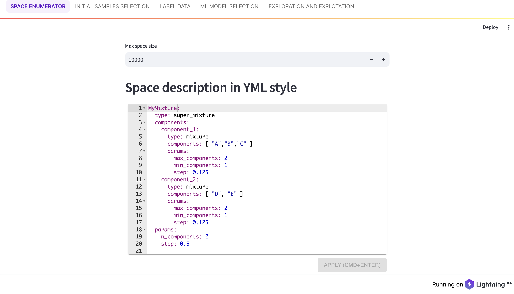

# CELO: Chemical Experiment Loop Orchistration 

## Introduction

CELO is a Python library with a lightning app web interface designed to accelerate experiment loops in the field of 
computational chemistry. It provides a versatile framework that can be applied to various tasks, allowing users to 
define an action space as a combination of actions and environmental factors.

**Key features of CELO include**:

- **Space Enumeration**: Enumerate the space of possible experiments based on user-defined parameters and constraints.
- **Diverse Sample Selection**: Select diverse samples from the enumerated space to ensure comprehensive coverage.
- **ML Model Selection**: Select and explore machine learning models suitable for the experiment loop.
- **Exploitation and Exploration**:  Modules for exploitation and exploration enable efficient selection of the next 
experiment and exploration of future spaces.
The web interface of CELO is designed to be user-friendly, allowing users to easily interact with the tool without 
requiring any prior computer science knowledge.

Whether you are a seasoned computational chemist or a newcomer to the field, CELO provides a powerful and intuitive 
platform for accelerating your research and experimentation process.


## Installation

The key dependencies are `lightning`, `streamlit`, `scikit-learn`, `autoglueon`, `pandas`, and `numpy`. 
For more details, refer to the file `conda_environment.yaml`.

### CELO Installation

To install CELO, use the following set of commands:

```bash
conda env create -f conda_environment.yml
conda activate celo
```
This will create a conda environment based on the specifications in `conda_environment.yml` and activate it.

If you are facing problems with long environment sync and dependency update, consider using mamba, a faster alternative 
to conda, for environment management. You can install mamba using conda:

```bash
conda install mamba -n base -c conda-forge
```


## Usage

CELO is a web application with a Lightning App backend and a Streamlit frontend. It can be run either locally or on a 
remote machine. The app has an asynchronous engine, allowing multiple users to use it simultaneously. However, it has 
not been tested under considerable parallel load.

To run the app, simply install the dependencies and use the following command:

```bash
  lightning_app run app app.py
```

This will start the application, and you can access it through your web browser.

<p float="left">
  
  
</p>


## ToDo

- [ ] Enhance documentation with detailed docstrings and expand user tutorial
- [ ] Conduct comprehensive testing to identify and resolve bugs
- [ ] Incorporate descriptors of molecules to enrich the chemical space
- [ ] Integrate the graph neural network pipeline into CLEO for streamlined functionality

## Notice

The package is still under development, and we welcome any feedback, suggestions, or contributions from the community. 
If you encounter any issues or have ideas for improvement, please don't hesitate to open an issue or submit a pull 
request on GitHub. Your input is valuable in helping us make the package better for everyone.


